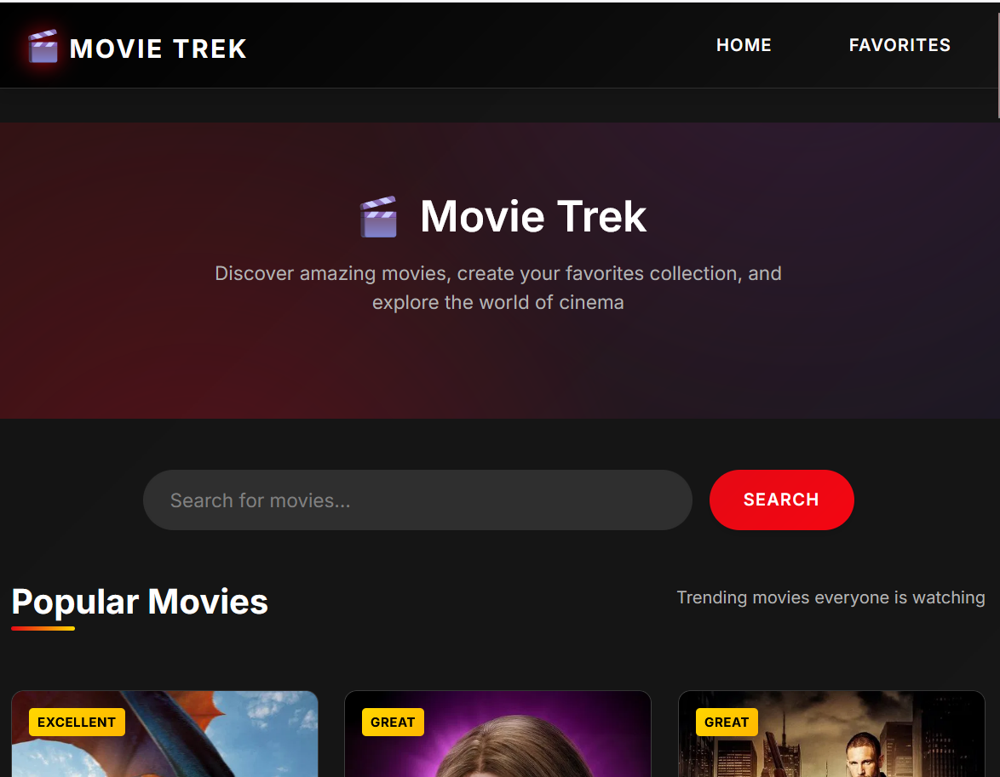
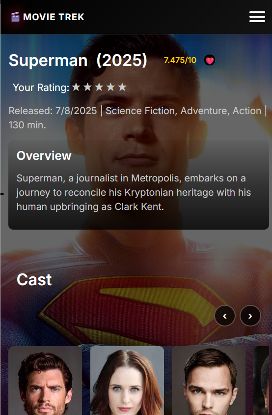
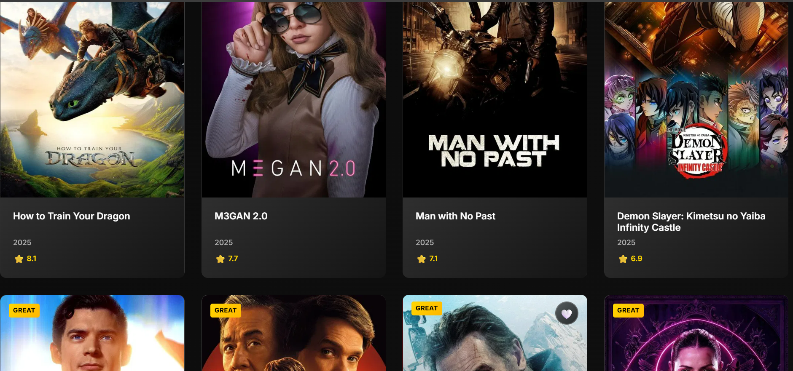
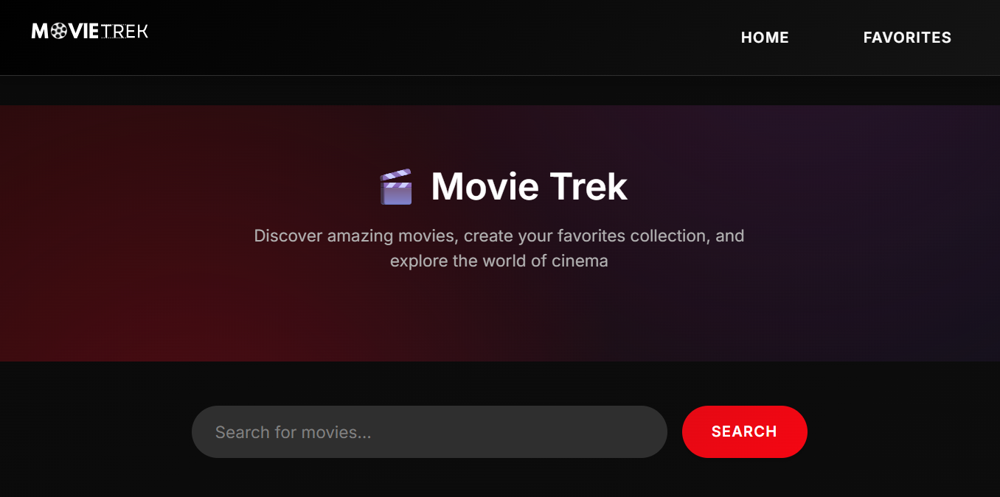
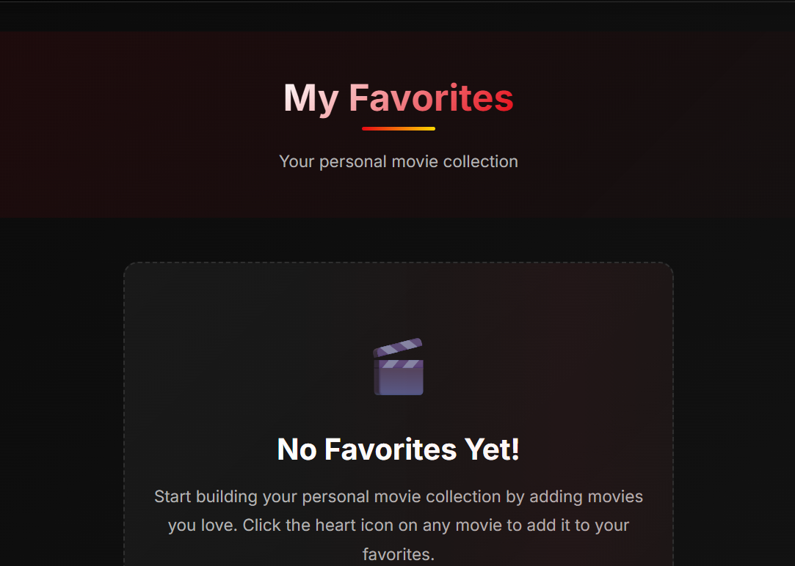

# 🎬 Movie Trek

A sleek, modern movie discovery app built with React that helps you explore and track your favorite films with persistent local-first data storage.

<div align="center">
  
</div>

📘 **Quick Links**:

- [Netlify Deployment Guide](DEPLOY.md)
- [Contributing Guidelines](CONTRIBUTING.md)
- [Tech Stack Overview](#%EF%B8%8F-technology-stack)

## 🌟 Features Showcase

<div align="center">
  <br/>
  <em>Dynamic Homepage with Trending Movies & Content Ratings</em>
  <br/><br/>
  <br/>
  <em>Rich Movie Details with Persistent Ratings & Favorites</em>
</div>

### ✨ Key Features

- **🎥 Trending Movies:** Stay updated with the latest and most popular films
- **🎭 Rich Movie Details:** Comprehensive information including cast, crew, and trailers
- **❤️ Persistent Favorites:** Local-first favorites system that never loses your data
- **⭐ Star Ratings:** Rate movies with persistent 5-star system
- **🏷️ Content Ratings:** Official MPAA ratings (G, PG, PG-13, R) from TMDB
- **🎬 Video Integration:** Watch trailers and clips directly in the app
- **💾 Local Storage:** All user data stored locally with Fireproof database
- **🌓 Dynamic UI:** Responsive design that works on all devices

## 🚀 Getting Started

### 1. Clone the Repository

```bash
git clone https://github.com/djdev3k-star/movie-trek-react-v1.git
cd movie-trek-react-v1
```

### 2. Install Dependencies

```bash
npm install
```

### 3. Set Up Environment Variables

1. Sign up at [The Movie Database (TMDB)](https://www.themoviedb.org/)
2. Get your API key
3. Create `.env` file:
   ```env
   VITE_TMDB_API_KEY=your_api_key_here
   ```

### 4. Start Development Server

```bash
npm run dev
```

## 🛠️ Technology Stack

- **Frontend Framework:** React + Vite
- **Database:** Fireproof (Local-first, syncable)
- **State Management:** React Context API + Fireproof
- **API Integration:** TMDB API
- **Styling:** CSS Modules
- **Deployment:** Netlify

## 🗄️ Data Persistence

Movie Trek uses **Fireproof**, a local-first database that provides:

- **Instant Performance:** User data stored locally in browser
- **Persistent Storage:** Data survives browser restarts and sessions
- **Real-time Updates:** Live queries update UI automatically
- **Data Sync:** Can sync across devices (when configured)
- **No Data Loss:** User preferences never lost

### Stored Data:
- ❤️ Favorite movies
- ⭐ User star ratings (1-5 stars)
- 🏷️ Content rating preferences
- 📝 Movie reviews and notes

## 📱 UI Components

<div align="center">
  
  
  <br/><br/>
  
  
</div>

## 🎯 Core Features

### **Movie Discovery**
- Browse trending and popular movies
- View detailed movie information with MPAA content ratings
- Watch trailers and clips
- Search movies with real-time results

### **User Features**
- **Persistent Favorites:** Heart icon toggles with instant feedback
- **Star Rating System:** Rate movies 1-5 stars with persistence
- **Content Ratings:** See official MPAA ratings (G, PG, PG-13, R)
- **Cast Information:** Browse detailed cast and crew info

### **Data Management**
- **Local-First Storage:** All user data stored locally with Fireproof
- **Real-Time Updates:** Changes reflect instantly across all pages
- **Session Persistence:** User data survives browser restarts
- **Data Integrity:** No loss of favorites or ratings

### **UI/UX**
- **Responsive Design:** Works on desktop, tablet, and mobile
- **Smooth Animations:** Polished interactions and transitions
- **Intuitive Navigation:** Easy-to-use interface
- **Error Handling:** Graceful error states and recovery

## 🔧 API Integration

### TMDB API Endpoints Used:
- `/movie/popular` - Popular movies
- `/search/movie` - Movie search
- `/movie/{id}` - Movie details
- `/movie/{id}/credits` - Cast and crew
- `/movie/{id}/videos` - Trailers and clips
- `/movie/{id}/release_dates` - Content ratings (MPAA)

## 🎨 UI Improvements

### Movie Cards:
- **Quality Badges:** "Excellent", "Great", "Good" based on TMDB ratings
- **Content Rating Badges:** Official MPAA ratings in top-right corner
- **Favorite Hearts:** Positioned below content rating, toggles pink/red
- **Responsive Layout:** Optimized for all screen sizes

### Movie Details:
- **Persistent Star Ratings:** 5-star system with Fireproof storage
- **Favorite Toggle:** Heart button with real-time updates
- **Content Rating Display:** Prominent MPAA rating badge
- **Enhanced Navigation:** Smooth scrolling cast and video sections

## 🔜 Roadmap

- [x] ~~Fireproof integration for persistent data~~
- [x] ~~TMDB content ratings display~~
- [x] ~~Persistent favorites system~~
- [x] ~~Star rating persistence~~
- [ ] User authentication with sync
- [ ] Movie recommendations based on ratings
- [ ] Advanced search filters
- [ ] User reviews and comments
- [ ] Watchlist functionality
- [ ] Social sharing features
- [ ] Cross-device data synchronization

## 🤝 Contributing

1. Fork the repository
2. Create your feature branch (`git checkout -b feature/AmazingFeature`)
3. Commit your changes (`git commit -m 'Add some AmazingFeature'`)
4. Push to the branch (`git push origin feature/AmazingFeature`)
5. Open a Pull Request

## 📄 License

This project is licensed under the MIT License - see the [LICENSE](LICENSE) file for details.

## 🙏 Acknowledgments

- Movie data provided by [TMDB](https://www.themoviedb.org/)
- Local-first database by [Fireproof](https://fireproof.storage/)
- Built with [Vite](https://vitejs.dev/)
- Deployed on [Netlify](https://www.netlify.com/)

## 🔍 Recent Updates

### v2.0.0 - Local-First Data & Content Ratings
- **🔥 Fireproof Integration:** Complete migration to local-first database
- **🏷️ Content Ratings:** MPAA ratings (G, PG, PG-13, R) on all movie cards
- **❤️ Enhanced Favorites:** Persistent favorites with real-time updates
- **⭐ Star Ratings:** Persistent 5-star rating system in movie details
- **�� UI Improvements:** Fixed layout, better badge positioning
- **📱 Responsive Design:** Optimized for all screen sizes

---

<div align="center">
  Made with ❤️ by <a href="https://github.com/djdev3k-star">djdev3k</a>
</div>